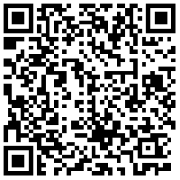

# react-native-roxie
Connect your music library to the devices around you.


## Purpose
Because it's not enough to just listen to your music, you need to experience it.  Connect your favorite tunes to a smart light and enjoy a show.  Using an Arduino, control your irrigation system and watch it dance.  All you need is a song in mind and a bluetooth device.

## How it works
Roxie analyzes the meter level of a song, assigns it a value, and emits a payload to the bluetooth connected device.

## How to customize
  We made it easy for you to connect and customize with a qr code:

  **Steps:**

  1. Discover your bluetooth device's peripheralId, characteristicUUID, and serviceUUID
  2. Decide what values you want to write to your device
  3. Fill out the below json object with your values:

```
  {
    "peripheralId": "DCA3C1F9-3BA2-4A2A-8107-88BF3B7C0DE0",
    "characteristicUUID": "FFE1",
    "serviceUUID": "FFE0",
    "values": [
      "0",
      "1",
      "2",
      "3"
    ]
  }
```
  4. Be sure to stringify the json object
  5. Convert it to a qr code
  6. Click Connect and scan your qr code
  7. Share your qr code with others. Send us a pr!

## Supported devices
  HM-10 Ble

## QR Codes

### HM-10 Ble

```
  {
    "peripheralId": "DCA3C1F9-3BA2-4A2A-8107-88BF3B7C0DE0",
    "characteristicUUID": "FFE1",
    "serviceUUID": "FFE0",
    "values": [
      "0",
      "1",
      "2",
      "3"
    ]
  }
```

## Installation
```
git clone
npm install
react-native link
```

## Testing and linting
We use jest for testing and eslint for linting.
```
  npm test
```
